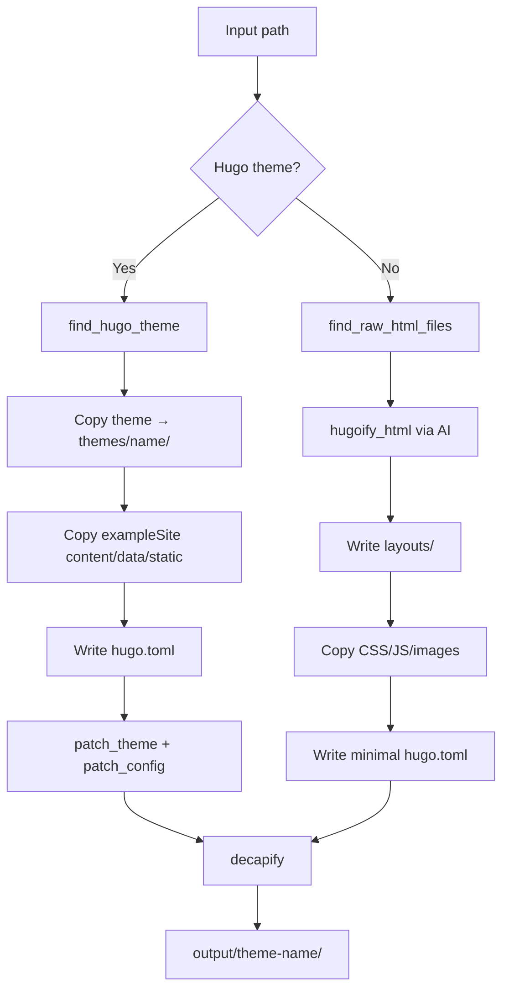

# Architecture

## Pipeline



## Module Map

| Module | Responsibility |
|--------|---------------|
| `src/cli.py` | Argument parsing, logging setup, error handling |
| `src/config.py` | Multi-backend AI routing (`call_ai`) |
| `src/utils/complete.py` | Full pipeline orchestration |
| `src/utils/theme_finder.py` | Locate Hugo theme + exampleSite within messy extracted directories |
| `src/utils/hugoify.py` | AI-powered HTML → Hugo layout conversion |
| `src/utils/decapify.py` | Generate Decap CMS `index.html` + `config.yml` |
| `src/utils/theme_patcher.py` | Patch deprecated Hugo APIs in layout files and config |
| `src/utils/analyze.py` | Theme structure reporting + AI-powered HTML analysis |
| `src/utils/translate.py` | AI content translation |
| `src/utils/deploy.py` | Cloudflare deployment _(stub)_ |
| `src/utils/cloudflare.py` | Cloudflare configuration _(stub)_ |
| `src/utils/parser.py` | HTML/CSS linting _(stub)_ |

## AI Backends

All AI calls route through a single `call_ai(prompt, system)` function in `src/config.py`. Switch backends via `HUGOIFIER_BACKEND`:

| Backend | Default Model | Env Var |
|---------|--------------|---------|
| `anthropic` (default) | `claude-sonnet-4-6` | `ANTHROPIC_API_KEY` |
| `openai` | `gpt-4-turbo` | `OPENAI_API_KEY` |
| `google` | `gemini-1.5-pro` | `GOOGLE_API_KEY` |

## Hugo API Patching

`theme_patcher.py` handles breaking changes in Hugo ≥ v0.128:

**Template patches:**

| Old | New |
|-----|-----|
| `.Site.DisqusShortname` | `.Site.Config.Services.Disqus.Shortname` |
| `.Site.GoogleAnalytics` | `.Site.Config.Services.GoogleAnalytics.ID` |

**Config patches (`hugo.toml`):**

| Old | New |
|-----|-----|
| `paginate = N` | `[pagination] pagerSize = N` |
| `googleAnalytics = "UA-..."` | `[services.googleAnalytics] id = "UA-..."` |
| `disqusShortname = "..."` | `[services.disqus] shortname = "..."` |

## Decap CMS Generation

`decapify.py` introspects `content/` to build Decap collections:

- **Folder collection** — subdirectory with `.md` files at any depth (blog, posts, etc.)
- **File collection** — subdirectory with only `_index.md` (about, contact, etc.)

Field types are inferred from YAML frontmatter values: `string`, `text`, `datetime`, `image`, `list`, `boolean`, `number`, `markdown`.

## Output Structure

```
output/{theme-name}/
├── hugo.toml              # Site config (modernized)
├── content/               # From exampleSite or minimal stub
├── data/                  # From exampleSite (if present)
├── static/
│   └── admin/
│       ├── index.html     # Decap CMS UI
│       └── config.yml     # Decap collections config
└── themes/
    └── {theme-name}/      # Patched Hugo theme
        ├── layouts/
        ├── static/
        └── archetypes/
```
